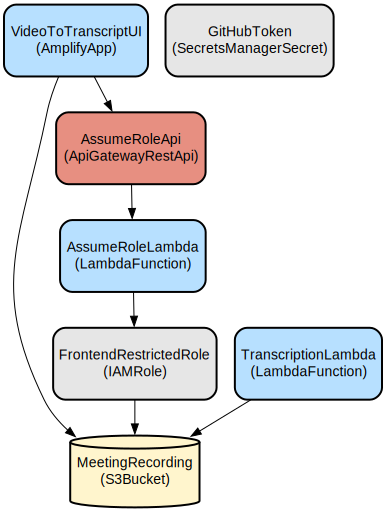

# Video-to-Transcript Portal: Automated Meeting Transcription Service

The Video-to-Transcript Portal is a web-based application that automatically generates text transcripts from uploaded meeting videos using AWS services. It provides a seamless user experience with real-time status updates and secure credential management for AWS resource access.

The application consists of a React-based frontend and AWS CDK infrastructure that leverages Amazon Transcribe for speech-to-text conversion. Users can upload meeting videos through an intuitive interface, and the system automatically processes them using AWS Lambda functions and S3 storage. The application implements secure temporary credentials through AWS STS and provides a downloadable transcript in plain text format.

## Disclaimers
Customers are responsible for making their own independent assessment of the information in this document.

This document:

(a) is for informational purposes only,

(b) references AWS product offerings and practices, which are subject to change without notice,

(c) does not create any commitments or assurances from AWS and its affiliates, suppliers or licensors. AWS products or services are provided "as is" without warranties, representations, or conditions of any kind, whether express or implied. The responsibilities and liabilities of AWS to its customers are controlled by AWS agreements, and this document is not part of, nor does it modify, any agreement between AWS and its customers, and

(d) is not to be considered a recommendation or viewpoint of AWS.

Additionally, you are solely responsible for testing, security and optimizing all code and assets on GitHub repo, and all such code and assets should be considered:

(a) as-is and without warranties or representations of any kind,

(b) not suitable for production environments, or on production or other critical data, and

(c) to include shortcuts in order to support rapid prototyping such as, but not limited to, relaxed authentication and authorization and a lack of strict adherence to security best practices.

All work produced is open source. More information can be found in the GitHub repo.

## Repository Structure
```
.
├── cdk_backend/                 # AWS CDK infrastructure code
│   ├── bin/                    # CDK app entry point
│   ├── lambda/                 # Lambda function implementations
│   │   ├── AssumeRoleFunction/ # Handles temporary AWS credentials
│   │   └── StartTranscriptionJob/ # Initiates transcription process
│   └── lib/                    # CDK stack definition
└── frontend/                   # React frontend application
    ├── src/
    │   ├── aws/               # AWS integration utilities
    │   ├── components/        # React components for upload/download
    │   └── utilities/         # Shared constants and helpers
```

## Usage Instructions
### Prerequisites
- Node.js 16.x or later
- AWS CLI configured with appropriate credentials
- AWS CDK CLI installed (`npm install -g aws-cdk`)
- Python 3.9 or later for Lambda functions
- GitHub personal access token for Amplify deployment

### Installation

1. Clone the repository and install dependencies:
```bash
# Install backend dependencies
cd cdk_backend
npm install

# Install frontend dependencies
cd ../frontend
npm install
```

2. Deploy the backend infrastructure:
```bash
cd cdk_backend
cdk deploy -c githubToken=<your-github-token>
```

### Quick Start
1. Access the deployed Amplify application URL provided in the CDK output
2. Click "Choose File" to select a meeting video
3. The video will automatically upload and begin processing
4. Wait for the transcript to be generated (progress is shown in real-time)
5. Download the transcript when ready

### More Detailed Examples

**Uploading a Video**
```typescript
// Using the UploadSection component
<UploadSection onUploadComplete={(fileName, creds) => {
  console.log(`File ${fileName} uploaded successfully`);
  // Credentials available in creds object
}} />
```

**Downloading a Transcript**
```typescript
// Using the DownloadSection component
<DownloadSection 
  videoFileName="meeting-2024-01-01.mp4"
  tempCreds={awsCredentials}
/>
```

### Troubleshooting

**Video Upload Fails**
- Error: "Access Denied"
  - Verify temporary credentials are not expired
  - Check S3 bucket permissions
  - Ensure file is within size limits

**Transcript Generation Delays**
- Enable debug logging in the Lambda function:
  ```python
  import logging
  logging.getLogger().setLevel(logging.DEBUG)
  ```
- Check CloudWatch logs at `/aws/lambda/StartTranscriptionJob`
- Verify Transcribe service quotas in your region

**Frontend Connection Issues**
- Check browser console for CORS errors
- Verify API Gateway endpoint is accessible
- Ensure environment variables are properly set in Amplify

## Data Flow
The application follows a serverless event-driven architecture for processing videos and generating transcripts.

```ascii
Upload                Process              Download
┌──────┐   S3    ┌──────────┐   S3    ┌──────────┐
│Client├─────────►│Lambda    ├─────────►│Transcribe│
└──┬───┘         │Function  │         └────┬─────┘
   │             └──────────┘              │
   │                                       │
   └───────────────────────────────────────┘
        Poll for completion & download
```

Key component interactions:
1. Frontend obtains temporary AWS credentials via AssumeRole Lambda
2. User uploads video to S3 bucket using temporary credentials
3. S3 event triggers StartTranscriptionJob Lambda
4. Lambda initiates Amazon Transcribe job
5. Frontend polls S3 for completed transcript
6. Transcript is delivered as downloadable text file
7. All operations use least-privilege IAM roles

## Infrastructure



### Lambda Functions
- `AssumeRoleFunction` (Python 3.9)
  - Provides temporary AWS credentials for frontend access
  - Environment variables: FRONTEND_ROLE_ARN, REGION
- `StartTranscriptionJob` (Python 3.12)
  - Initiates Amazon Transcribe jobs
  - Environment variables: BUCKET_NAME, OUTPUT_FOLDER

### Storage
- S3 Bucket
  - Enforces SSL
  - CORS enabled for frontend access
  - Separate prefixes for videos and transcripts

### API Gateway
- REST API for AssumeRole function
- CORS enabled for frontend access
- GET /assumerole endpoint

### IAM
- FrontendRestrictedRole
  - Limited S3 access for video upload
  - Read-only access to transcripts

### Amplify
- Hosts frontend application
- Automated builds from GitHub repository
- Environment variables for AWS resource configuration

## Deployment
1. Prerequisites:
   - AWS account with appropriate permissions
   - GitHub token with repository access
   - AWS CDK CLI installed

2. Deploy infrastructure:
```bash
cd cdk_backend
cdk deploy -c githubToken=<your-github-token>
```

3. Configure frontend:
   - Environment variables are automatically set by CDK
   - Amplify handles continuous deployment

4. Monitor deployment:
   - Check Amplify console for frontend build status
   - Verify CloudFormation stack creation
   - Test API Gateway endpoints